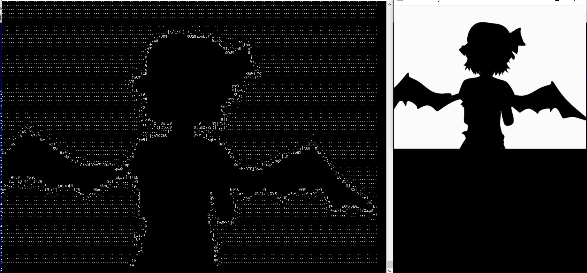

transfrom video frames to visual ascii

## usage

open cmd console and run ```python video2ascii.py your_video.mp4```command,program print
ascii on the console. You should adjust the font size of console and console size to make
it just playing video.


## result


