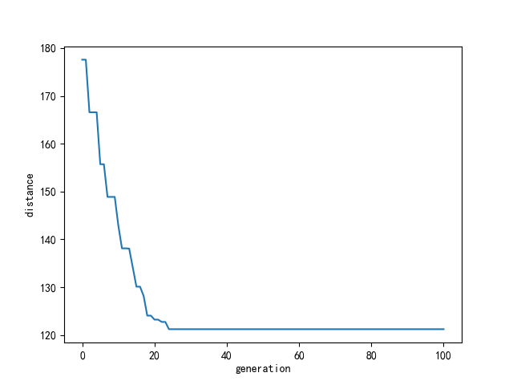
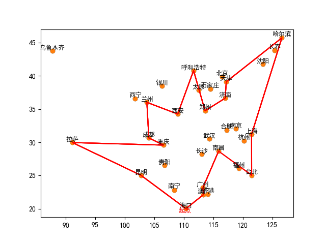

# 遗传算法解决TSP问题

## 问题描述

旅行商问题也叫旅行推销员问题（Travelling salesman problem, TSP）：假设有一个旅行商人要拜访n 个城市，每个城市只能拜访一次，而且最后要回到原来出发的城市。那么旅行商在何种路径选择的情况下，最后总路程最小。在数学中其被定义为NP 困难问题，在运筹学和理论计算机科学中非常重要。最早的旅行商问题的数学规划是由Dantzig（1959）等人提出，并且是在最优化领域中进行了深入研究。许多优化方法都用它作为一个测试基准。尽管问题在计算上很困难，但已经有了大量的启发式和精确方法来求解数量上万的实例，并且能将误差控制在1%内。

对于TSP 这类NP 困难问题，目前比较主流的方法是采用启发式的搜索算法，比如遗传算法、蚁群算法、模拟退火算法等。在本次实验中，要求通过遗传算法来解决TSP 问题。

## 目录简介

src目录下是源码，主要实现的文件是 source.py，ui.py是图形用户界面的接口，执行ui.py即可

# 实现效果

主界面

程序运行结果

1. 收敛图像，纵坐标distance表示距离，横坐标generation表示标出的代数

2. 路线图像

3. 计算出来的距离

